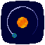

   
<b>Solar System Simulator</b>
 •
   
  
 
==========================================================

What this project aims to do is simply simulate interactions between celestial bodies. There are some important things to note about it:

- The space is **2D**, which is kind of a bummer, but not much.

- The Sun, or special **Immovable** (in the code it's literally an 'is_sun' property) **objects** aren't affected by gravity, but they can exert their own on other planets.

- Unless Real-Size mode is used, Planets will be scaled to be 300 times their real size, and Suns to be 25 times their real sizes.

- Initial orbits are perfectly circular

- For some reason I still haven't figured out, although everything works perfectly, the velocities are much bigger than real ones.

- By default, a smaller solar system is used, for mainly aesthetic purposes, but the full system can be reenabled in the settings.

- Negative mass objects can be created. I don't know how, I didn't make any special implementations, it just works!

Starting the simulation for the first time will download real planet positions using the **Skyfield module**, which means it might take a moment to start-up the first time.

== **Controls** ==

C - Toggle between Heliocentric view and freecam

Space - Pause

Left Click (on space) - Keep holding to move in space

Left Click (on planet) - Goes into "Launching" mode; you can pull and, on release, the planet will be launched in the opposite direction

Right Click (on planet) - Follow planet, stop following by right-clicking anywhere else

Mouse Wheel - Zoom

S - Toggle Settings

Q - Create planet at current mouse position

R - Real-Time mode; time will pass at 1:1 to real life. (sets dt to 1/60)

P - Real-Size mode; planets will scale to their actual size. More realistic, but space between planets are absolutely gargantuan compared to the planets.

D - Clear tails